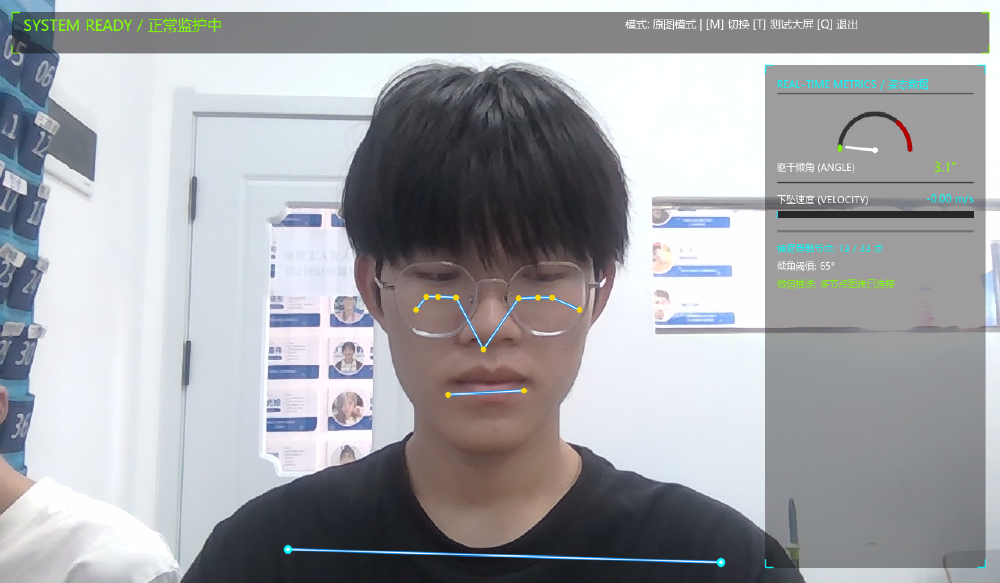
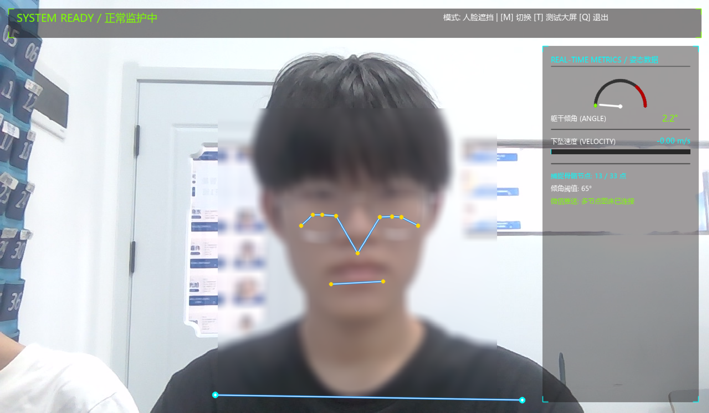
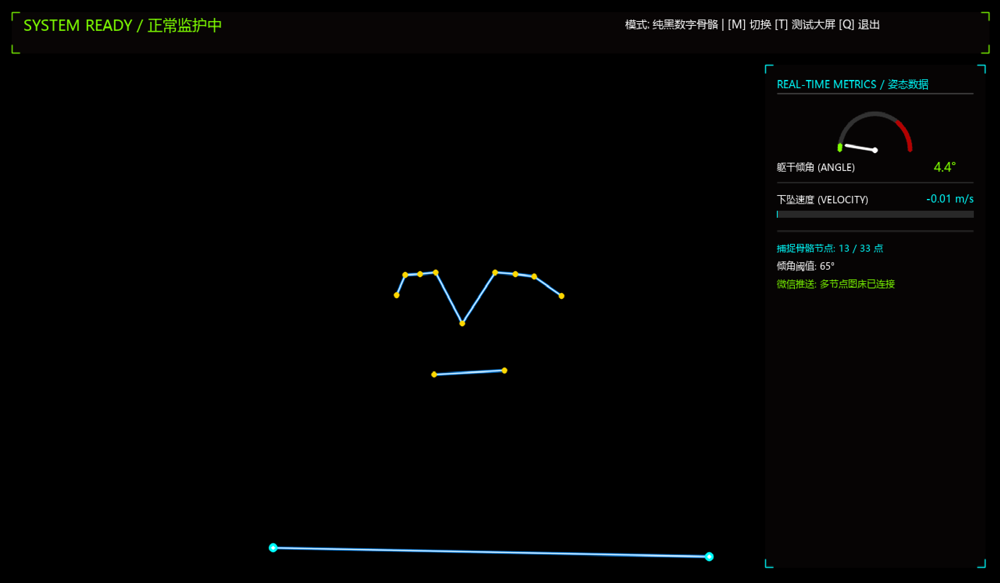
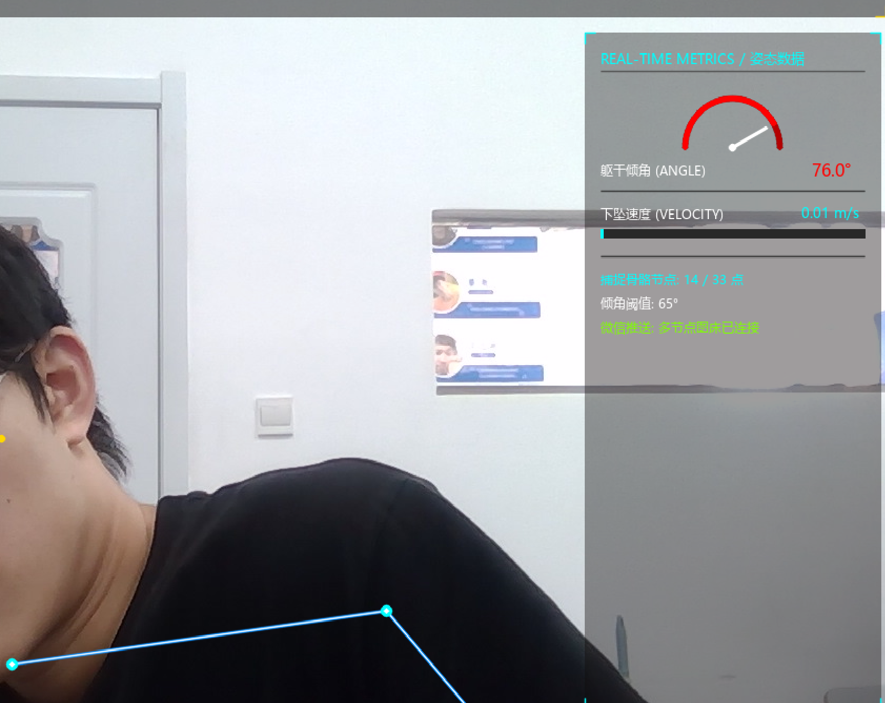
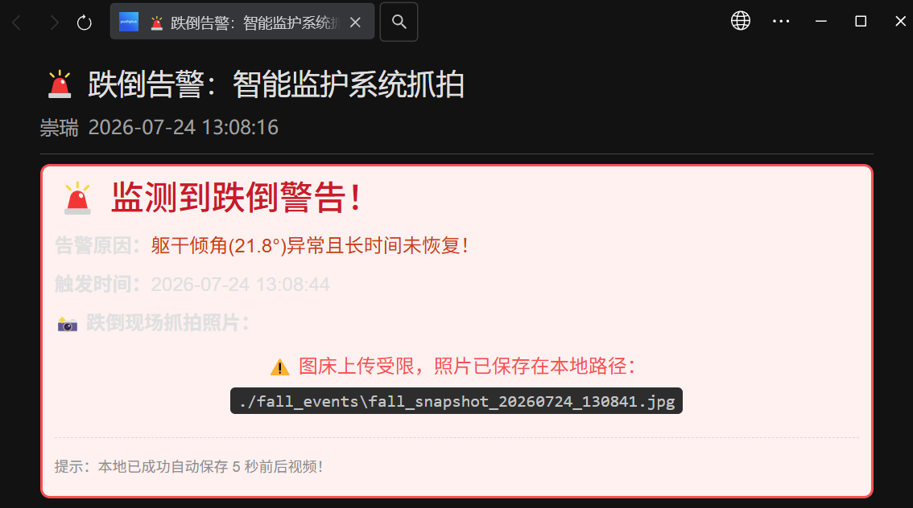

# 🛡️ FallGuard-CV: 基于计算机视觉的实时人体姿态识别与跌倒监护系统

> **FallGuard-CV** 是一款基于 OpenCV 和 MediaPipe 骨骼关键点检测的智能视觉监护系统。系统能够精准分类识别人体日常动作（站立、行走、坐下、起立、弯腰捡东西、躺卧等），并在发生突发性跌倒或失能异常姿态时，实现毫秒级响应、本地声音报警、5秒前后视频自动回溯留存以及微信 PushPlus 抓拍图像实时推送。

---

## 📸 系统运行与效果展示 (System Showcase)

### 1. 动态隐私保护与多模式监护 (Multi-Mode Privacy Protection)
针对家庭监护与养老院场景中的隐私敏感需求，系统支持按键盘 `M` 键自由切换三种视觉监护模式，在保障算法识别精度的同时，最大程度保护被监护人的个人隐私：

| 模式 1：原图监护模式 | 模式 2：人脸动态高斯模糊模式 | 模式 3：纯黑数字骨骼模式 |
| :---: | :---: | :---: |
|  |  |  |
| **正常光照/常规监护**<br>实时绘制人体骨骼关键点及姿态数据 HUD 面板。 | **隐私遮挡模式**<br>基于动态人脸定位实现高斯模糊，保护用户面部隐私。 | **夜间/极简监护模式**<br>彻底屏蔽真实图像背景与人脸，仅保留矢量骨骼连接。 |

---

### 2. 突发跌倒检测与姿态判定 (Fall Detection Mechanism)
系统实时提取 33 个骨骼关键点，结合**躯干倾角（Angle）**、**下坠速度（Velocity）**及**高宽比（Aspect Ratio）**等多维几何力学算法。当躯干倾角超过预设阈值（如 $65^\circ$）且保持异常姿态时，系统自动触发告警状态。


*图：系统实时监测躯干倾角，当倾角达到 $76.0^\circ$（超过阈值 $65^\circ$）时，HUD 仪表盘标红并进入摔倒预警状态。*

---

### 3. 多终端实时告警与事件回溯 (Alert Notification & Event Log)
一旦确认跌倒事件，系统即刻完成本地音效报警、5秒环形视频回溯导出（前 3 秒与后 2 秒），并通过 PushPlus 微信推送 API 实时将告警信息及抓拍图文发送至监护人手机终端：


*图：监护人手机终端接收到的 PushPlus 微信告警通知，包含触发时间、异常躯干倾角数据、本地视频保存路径及现场抓拍图文信息。*

---

## ✨ 核心功能与亮点 (Key Features)

- 🦴 **全姿态骨骼追踪与动作分类 (Full-Body Pose Estimation)**
  - 基于 MediaPipe 提取人体 33 个骨骼关键点，结合躯干倾角、下坠速度及高宽比（Aspect Ratio）等多维度几何力学算法。
  - 精准区分日常干扰动作（弯腰拾物、坐下起立、蹲下、躺卧）与真实跌倒，大幅降低误报率。

- 🚨 **分级状态响应机制 (Multi-State Early Warning)**
  - **NORMAL（正常监护）**：绿色 HUD 显示，系统平稳监控。
  - **SUSPECTED（疑似观察）**：黄色 HUD 显示，触发倾角/加速度异常时进入毫秒级二次观察期，自动过滤短暂弯腰或抖动。
  - **FALL_ALERT（摔倒告警）**：红色 HUD 闪烁，自动播放报警音效并启动云端推送与视频备份。

- 📸 **事件抓拍与 5s 视频回溯留存 (Event Capture & Video Buffer)**
  - 采用**环形帧缓冲区（Ring Buffer）**技术，实时保存报警发生前 3 秒与后 2 秒的高清画面，自动导出 5 秒短视频至本地进行责任溯源。

- 📲 **微信实时推送与多节点图床 (WeChat Push & Image Hosting)**
  - 接入 PushPlus 微信推送 API，结合多节点公网图床自动上传现场高清抓拍照片，实现远端无延迟警报。

- 🔒 **隐私防护与双屏交互控制 (Privacy & Interactive HUD)**
  - 提供多档隐私模式切换（原图 / 人脸动态高斯模糊 / 纯数字骨骼模式）。
  - 支持从实时摄像头监控一键无缝跳转至视频离线分析大屏（PyQt5 开发），便于批量回归测试与算法校验。

---

## 📸 系统运行与效果展示 (System Showcase)

### 🎥 实时检测与告警演示视频 (Demo Video)

<div align="center">
  <video src="https://github.com/user-attachments/assets/c645571c-326e-4880-a5a8-57cc68293315" controls width="100%" poster="./picture3.jpg">您的浏览器不支持 HTML5 视频播放，请直接点击查看：<a href="https://github.com/user-attachments/assets/c645571c-326e-4880-a5a8-57cc68293315">演示视频链接</a></video>
  <p><i>📹 <b>视频演示</b>：FallGuard-CV 姿态追踪、三种隐私模式切换、跌倒识别与微信 PushPlus 实时告警全流程</i></p>
</div>

---

---

---

## 🛠️ 技术栈 (Tech Stack)

| 模块 | 技术选型 |
| :--- | :--- |
| **编程语言** | Python 3.8+ |
| **计算机视觉** | OpenCV, MediaPipe (Pose Estimation) |
| **GUI 界面** | PyQt5 |
| **数据计算与绘图** | NumPy, Pillow |
| **音频与网络** | Pygame, Requests, PushPlus API |

---

## 🚀 快速开始 (Quick Start)

### 1. 克隆项目与安装依赖
```bash
git clone [https://github.com/YourUsername/FallGuard-CV.git](https://github.com/YourUsername/FallGuard-CV.git)
cd FallGuard-CV
pip install -r requirements.txt
